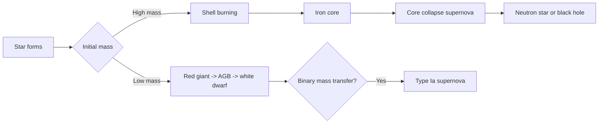

```mermaid
flowchart LR
  A["Star forms"] --> B{"Initial mass"}
  B -->|"Low mass"| C["Red giant -> AGB -> white dwarf"]
  B -->|"High mass"| D["Shell burning"]
  D --> E["Iron core"]
  E --> F["Core collapse supernova"]
  F --> G["Neutron star or black hole"]
  C --> H{"Binary mass transfer?"}
  H -->|"Yes"| I["Type Ia supernova"]
```

*What to notice: “supernova” is not a single mechanism. Massive stars explode by collapse; white dwarfs in binaries explode by thermonuclear runaway.*
