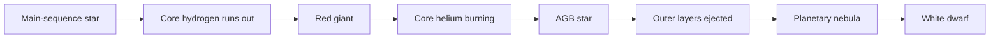
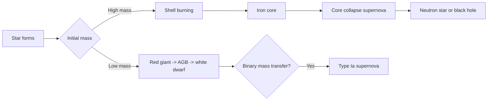

# Lecture 20 Textbook Figure Suite Implementation Plan

> **For Claude:** REQUIRED SUB-SKILL: Use superpowers:executing-plans to implement this plan task-by-task.

**Goal:** Build and integrate a published-textbook-quality figure suite for Lecture 20 that makes stellar death legible through a small number of scientifically correct, pedagogically explicit, visually polished diagrams and plots.

**Architecture:** Keep the figure system split by medium. Rendered assets live under `assets/images/module-02/lecture-20/` and are registered in `assets/figures.yml` for use via ``, while Mermaid evolutionary flowcharts live in `_includes/figures/` and are inserted directly with `` because the current `fig` shortcode only renders images. Reuse the existing lecture structure in `modules/module-02/readings/lecture-20-how-stars-die.qmd`, keep current figures in place during the first integration pass, and postpone pruning until after visual review.

**Tech Stack:** Quarto `.qmd`, Mermaid include blocks, YAML figure registry, SVG + PNG asset pipeline, Python/Matplotlib, `scripts/render_svg_to_png.py`, `conda run -n astro`, course shortcodes (``, ``).

---

## Non-Negotiables

- Use `@astro-svg-figures` for every SVG or infographic-quality asset.
- Use `@astr201-figures` for every registry entry and caption/alt-text pass.
- Do not ship default Matplotlib styling, thin default fonts, raw legend clutter, or unreviewed SVG exports.
- All rendered plots and infographic-style SVG assets for the reading must use a **white background** (not transparent, not dark-mode-first).
- Every new figure must answer exactly one teaching question and support one inference.
- Every SVG must render cleanly to both PNG and PDF using `scripts/render_svg_to_png.py`.
- Keep existing Lecture 20 figures during the first pass unless the new asset is a direct replacement. Pruning happens only after side-by-side review.

## Figure Package Scope

**New rendered assets**
- `lecture-20-mass-determines-fate.svg`
- `lecture-20-white-dwarf-hot-but-dim.svg`
- `lecture-20-onion-burning-timescales.svg`
- `lecture-20-core-collapse-energy-budget.svg`
- `lecture-20-typeia-vs-typeii-evidence.svg`

**Mermaid include figures**
- `_includes/figures/lecture-20-low-mass-death-pathway.qmd`
- `_includes/figures/lecture-20-massive-and-binary-death-pathways.qmd`

**Existing assets to keep during first integration**
- `jwst-ring-nebula`
- `binding-energy-iron-peak`
- `core-collapse-sequence`
- `typeii-core-collapse-neutrino-heating`

**Existing assets marked for post-review pruning decision**
- `jwst-wr124`
- `eta-carinae-hubble`
- `supernova-xray-fingerprints`
- `solar-system-element-origins-module2`

## Visual Quality Bar

- Typography: large, deliberate labels; no tiny axis text; no cramped legends; no decorative font switching.
- Color: use the course jewel palette and neutral panel colors already encoded in `scripts/render_svg_to_png.py`.
- Background: white page-ground for every new chart and infographic so the reading feels like a published textbook page, not a slide deck export.
- Layout: generous spacing, explicit hierarchy, alignment that feels typeset rather than auto-generated.
- Pedagogy: “What to notice” must be visually obvious before the caption explains it.
- Scientific correctness: approximate values must be labeled approximate; schematic spectra must be labeled schematic; flowcharts must not imply false determinism beyond the reading’s stated simplifications.

### Task 1: Set up the Lecture 20 figure workspace

**Files:**
- Create: `assets/images/module-02/lecture-20/`
- Create: `assets/images/module-02/lecture-20/_previews/`
- Create: `scripts/generate_lecture20_figures.py`
- Reference: `scripts/generate_lecture19_figures.py`
- Reference: `scripts/render_svg_to_png.py`

**Step 1: Create the output directories**

Run:

```bash
mkdir -p assets/images/module-02/lecture-20 assets/images/module-02/lecture-20/_previews
```

Expected: both directories exist.

**Step 2: Scaffold the generator script**

Create `scripts/generate_lecture20_figures.py` with:
- `ROOT` and `OUTPUT_DIR` constants
- a shared palette matching `scripts/generate_lecture19_figures.py`
- `BG = "#ffffff"` and matching light-mode panel colors as the default export style
- one CLI switch: `--figure` with values `mass-fate`, `white-dwarf-compare`, `onion-timescales`, `energy-budget`, `supernova-evidence`, `all`
- one helper: `configure_matplotlib()`
- one helper: `save_svg(fig, name)`

Expected: the script can be invoked without import errors.

**Step 3: Smoke-test the script entrypoint**

Run:

```bash
conda run -n astro python scripts/generate_lecture20_figures.py --help
```

Expected: help text lists the five figure keys plus `all`.

**Step 4: Commit scaffolding**

```bash
git add scripts/generate_lecture20_figures.py
git commit -m "plan: scaffold lecture 20 figure generator"
```

### Task 2: Add the Mermaid evolutionary flowcharts

**Files:**
- Create: `_includes/figures/lecture-20-low-mass-death-pathway.qmd`
- Create: `_includes/figures/lecture-20-massive-and-binary-death-pathways.qmd`
- Modify later: `modules/module-02/readings/lecture-20-how-stars-die.qmd`

**Step 1: Add the low-mass pathway include**

Create `_includes/figures/lecture-20-low-mass-death-pathway.qmd` with this exact Mermaid block:

```markdown

```

Add one sentence below it:

```markdown
*What to notice: low-mass stars die through structural change and mass loss, not explosion.*
```

**Step 2: Add the massive/binary pathway include**

Create `_includes/figures/lecture-20-massive-and-binary-death-pathways.qmd` with this exact Mermaid block:

```markdown

```

Add one sentence below it:

```markdown
*What to notice: “supernova” is not a single mechanism. Massive stars explode by collapse; white dwarfs in binaries explode by thermonuclear runaway.*
```

**Step 3: Render-check one Mermaid include in isolation**

Run:

```bash
conda run -n astro quarto render modules/module-02/readings/lecture-20-how-stars-die.qmd
```

Expected: render still succeeds after later insertion of these includes.

**Step 4: Commit the Mermaid includes**

```bash
git add _includes/figures/lecture-20-low-mass-death-pathway.qmd _includes/figures/lecture-20-massive-and-binary-death-pathways.qmd
git commit -m "feat: add lecture 20 mermaid evolution flowcharts"
```

### Task 3: Build the mass-determines-fate hero figure

**Files:**
- Modify: `scripts/generate_lecture20_figures.py`
- Create: `assets/images/module-02/lecture-20/lecture-20-mass-determines-fate.svg`
- Preview: `assets/images/module-02/lecture-20/_previews/lecture-20-mass-determines-fate.png`
- Preview: `assets/images/module-02/lecture-20/_previews/lecture-20-mass-determines-fate.pdf`

**Step 1: Implement `render_mass_fate_figure()`**

The figure must:
- read like a polished infographic, not a plain flowchart
- have three visual lanes: low-mass, massive-star, white-dwarf-in-binary
- include concise endpoint labels
- visually emphasize that initial mass is the main branch point

Use SVG-first output, either through Matplotlib annotation layout or hand-authored SVG content emitted from Python.

**Step 2: Generate the SVG**

Run:

```bash
conda run -n astro python scripts/generate_lecture20_figures.py --figure mass-fate
```

Expected: `assets/images/module-02/lecture-20/lecture-20-mass-determines-fate.svg` exists.

**Step 3: Export preview artifacts**

Run:

```bash
conda run -n astro python scripts/render_svg_to_png.py assets/images/module-02/lecture-20/lecture-20-mass-determines-fate.svg assets/images/module-02/lecture-20/_previews/lecture-20-mass-determines-fate.png --format png --width 1800 --theme light --palette aurora
conda run -n astro python scripts/render_svg_to_png.py assets/images/module-02/lecture-20/lecture-20-mass-determines-fate.svg assets/images/module-02/lecture-20/_previews/lecture-20-mass-determines-fate.pdf --format pdf --width 1800 --theme light --palette aurora
```

Expected: PNG and PDF previews render without missing fills, broken text, or cramped labels.

**Step 4: Perform visual QA**

Check:
- branch spacing feels deliberate
- labels remain legible at half-size
- the figure sits cleanly on a white background with no muddy gray paneling
- no line crossings or “default diagram” look
- no unsupported scientific claim beyond the lecture’s stated simplification

**Step 5: Commit**

```bash
git add scripts/generate_lecture20_figures.py assets/images/module-02/lecture-20/lecture-20-mass-determines-fate.svg
git commit -m "feat: add lecture 20 mass determines fate figure"
```

### Task 4: Build the white dwarf “hot but dim” comparison panel

**Files:**
- Modify: `scripts/generate_lecture20_figures.py`
- Create: `assets/images/module-02/lecture-20/lecture-20-white-dwarf-hot-but-dim.svg`
- Preview: `assets/images/module-02/lecture-20/_previews/lecture-20-white-dwarf-hot-but-dim.png`

**Step 1: Implement `render_white_dwarf_comparison()`**

The panel must compare:
- Sun radius vs white dwarf radius
- Sun temperature vs white dwarf temperature
- Sun luminosity vs white dwarf luminosity

Do **not** use a mixed-units grouped bar chart. Use:
- side-by-side size circles
- compact numeric callouts
- one luminosity inference box tied to `L \propto R^2 T^4`

**Step 2: Generate the figure**

Run:

```bash
conda run -n astro python scripts/generate_lecture20_figures.py --figure white-dwarf-compare
```

Expected: `assets/images/module-02/lecture-20/lecture-20-white-dwarf-hot-but-dim.svg` exists.

**Step 3: Export light-theme preview**

Run:

```bash
conda run -n astro python scripts/render_svg_to_png.py assets/images/module-02/lecture-20/lecture-20-white-dwarf-hot-but-dim.svg assets/images/module-02/lecture-20/_previews/lecture-20-white-dwarf-hot-but-dim.png --format png --width 1800 --theme light --palette aurora
```

Expected: the size contrast is obvious before reading any labels.

**Step 4: QA against misconception resistance**

Check:
- hotter does not look brighter by default
- tiny surface area is visually dominant
- the panel reads cleanly against a white page background
- the equation is support text, not the whole figure

**Step 5: Commit**

```bash
git add scripts/generate_lecture20_figures.py assets/images/module-02/lecture-20/lecture-20-white-dwarf-hot-but-dim.svg
git commit -m "feat: add lecture 20 white dwarf comparison figure"
```

### Task 5: Build the onion-shell burning timescale chart

**Files:**
- Modify: `scripts/generate_lecture20_figures.py`
- Create: `assets/images/module-02/lecture-20/lecture-20-onion-burning-timescales.svg`
- Preview: `assets/images/module-02/lecture-20/_previews/lecture-20-onion-burning-timescales.png`

**Step 1: Implement `render_onion_burning_timescales()`**

Requirements:
- horizontal bar chart
- log-scaled duration axis
- stages: H, He, C, Ne, O, Si
- explicit note: “illustrative durations for a massive star; exact values depend on mass/model”
- typography and annotation style must match the other Lecture 20 assets

**Step 2: Generate the chart**

Run:

```bash
conda run -n astro python scripts/generate_lecture20_figures.py --figure onion-timescales
```

Expected: `assets/images/module-02/lecture-20/lecture-20-onion-burning-timescales.svg` exists.

**Step 3: Export preview**

Run:

```bash
conda run -n astro python scripts/render_svg_to_png.py assets/images/module-02/lecture-20/lecture-20-onion-burning-timescales.svg assets/images/module-02/lecture-20/_previews/lecture-20-onion-burning-timescales.png --format png --width 1800 --theme light --palette aurora
```

Expected: the acceleration toward collapse is obvious at a glance.

**Step 4: QA chart design**

Check:
- no default Matplotlib grid or legend styling
- annotations do not overlap bars
- the white background is intentional and publication-clean rather than empty or washed out
- the log axis is explained clearly enough for ASTR 101 readers

**Step 5: Commit**

```bash
git add scripts/generate_lecture20_figures.py assets/images/module-02/lecture-20/lecture-20-onion-burning-timescales.svg
git commit -m "feat: add lecture 20 onion burning timescale chart"
```

### Task 6: Build the core-collapse energy-budget figure

**Files:**
- Modify: `scripts/generate_lecture20_figures.py`
- Create: `assets/images/module-02/lecture-20/lecture-20-core-collapse-energy-budget.svg`
- Preview: `assets/images/module-02/lecture-20/_previews/lecture-20-core-collapse-energy-budget.png`

**Step 1: Implement `render_energy_budget()`**

The figure must show:
- neutrinos dominate the energy budget
- ejecta kinetic energy is much smaller
- visible light is tiny

Use a ledger-style stacked graphic or annotated proportional bar. Do **not** use a standard pie chart.

**Step 2: Generate the figure**

Run:

```bash
conda run -n astro python scripts/generate_lecture20_figures.py --figure energy-budget
```

Expected: `assets/images/module-02/lecture-20/lecture-20-core-collapse-energy-budget.svg` exists.

**Step 3: Export preview**

Run:

```bash
conda run -n astro python scripts/render_svg_to_png.py assets/images/module-02/lecture-20/lecture-20-core-collapse-energy-budget.svg assets/images/module-02/lecture-20/_previews/lecture-20-core-collapse-energy-budget.png --format png --width 1800 --theme light --palette aurora
```

Expected: visible light is not lost entirely, but is clearly subordinate.

**Step 4: QA scientific language**

Check:
- percentages are approximate, not falsely precise
- labels distinguish total collapse energy, ejecta kinetic energy, and visible light
- the figure uses a white background and readable contrast for all labeled regions
- the figure does not imply neutrinos “cause” the visible flash directly

**Step 5: Commit**

```bash
git add scripts/generate_lecture20_figures.py assets/images/module-02/lecture-20/lecture-20-core-collapse-energy-budget.svg
git commit -m "feat: add lecture 20 energy budget figure"
```

### Task 7: Build the Type Ia vs Type II evidence figure

**Files:**
- Modify: `scripts/generate_lecture20_figures.py`
- Create: `assets/images/module-02/lecture-20/lecture-20-typeia-vs-typeii-evidence.svg`
- Preview: `assets/images/module-02/lecture-20/_previews/lecture-20-typeia-vs-typeii-evidence.png`

**Step 1: Implement `render_supernova_evidence()`**

Structure the figure as three aligned columns:
- observable cue (schematic spectrum and hydrogen/no-hydrogen cue)
- progenitor sketch
- mechanism/outcome

Label the spectra explicitly as schematic.

**Step 2: Generate the figure**

Run:

```bash
conda run -n astro python scripts/generate_lecture20_figures.py --figure supernova-evidence
```

Expected: `assets/images/module-02/lecture-20/lecture-20-typeia-vs-typeii-evidence.svg` exists.

**Step 3: Export preview**

Run:

```bash
conda run -n astro python scripts/render_svg_to_png.py assets/images/module-02/lecture-20/lecture-20-typeia-vs-typeii-evidence.svg assets/images/module-02/lecture-20/_previews/lecture-20-typeia-vs-typeii-evidence.png --format png --width 1800 --theme light --palette aurora
```

Expected: students can infer the classification logic without reading the surrounding prose first.

**Step 4: QA against taxonomy overload**

Check:
- the figure teaches classification from evidence
- it does not collapse into a dense comparison table
- the white background preserves a clean textbook look instead of a presentation-slide aesthetic
- the spectra are simple enough for ASTR 101

**Step 5: Commit**

```bash
git add scripts/generate_lecture20_figures.py assets/images/module-02/lecture-20/lecture-20-typeia-vs-typeii-evidence.svg
git commit -m "feat: add lecture 20 supernova evidence figure"
```

### Task 8: Register all new rendered figures

**Files:**
- Modify: `assets/figures.yml`

**Step 1: Add new figure ids**

Add these ids under the Module 2 figure section:
- `lecture-20-mass-determines-fate`
- `lecture-20-white-dwarf-hot-but-dim`
- `lecture-20-onion-burning-timescales`
- `lecture-20-core-collapse-energy-budget`
- `lecture-20-typeia-vs-typeii-evidence`

**Step 2: Add required metadata**

Each entry must include:
- `path`
- `caption` beginning with `What to notice:`
- `alt`
- `credit: "Illustration: A. Rosen (...)"` with medium noted
- `module: 2`

**Step 3: Registry sanity check**

Run:

```bash
rg -n "lecture-20-(mass-determines-fate|white-dwarf-hot-but-dim|onion-burning-timescales|core-collapse-energy-budget|typeia-vs-typeii-evidence)" assets/figures.yml
```

Expected: all five ids resolve exactly once.

**Step 4: Commit**

```bash
git add assets/figures.yml
git commit -m "feat: register lecture 20 figure suite"
```

### Task 9: Integrate the new figures into Lecture 20 without pruning yet

**Files:**
- Modify: `modules/module-02/readings/lecture-20-how-stars-die.qmd`

**Step 1: Insert the mass-fate hero figure**

Add after the `## The Big Idea` callout:

```markdown

```

**Step 2: Insert the low-mass Mermaid flowchart**

Add near the end of `### When a Star Runs Out of Time` or immediately before `### The Planetary Nebula: What Are We Actually Seeing?`:

```markdown

```

**Step 3: Insert the white-dwarf comparison panel**

Add in `### Why Are White Dwarfs Dim Even Though They Are Hot?` before the `Check Yourself` block:

```markdown

```

**Step 4: Insert the massive/binary Mermaid flowchart**

Add at the start of `## Part 2: The Violent Death — Massive Stars and Supernovae` or in the transition block:

```markdown

```

**Step 5: Insert the onion-shell timescale chart**

Add immediately after ``:

```markdown

```

**Step 6: Keep the existing collapse sequence**

Do not remove:

```markdown

```

This remains the step-by-step mechanism figure for the first review pass.

**Step 7: Insert the energy-budget figure**

Add in `### Core Collapse: What Actually Happens?` immediately before or after the `Energy Ledger` callout:

```markdown

```

**Step 8: Insert the supernova evidence figure**

Add in `## Part 3: Type Ia Supernovae — A Different Kind of Explosion` before the comparison table:

```markdown

```

**Step 9: Preserve existing review candidates**

Do not prune yet:
- `jwst-wr124`
- `eta-carinae-hubble`
- `supernova-xray-fingerprints`
- `solar-system-element-origins-module2`

Leave them in place for side-by-side review after render.

**Step 10: Commit**

```bash
git add modules/module-02/readings/lecture-20-how-stars-die.qmd _includes/figures/lecture-20-low-mass-death-pathway.qmd _includes/figures/lecture-20-massive-and-binary-death-pathways.qmd
git commit -m "feat: integrate lecture 20 textbook figure suite"
```

### Task 10: Render, review, and prune

**Files:**
- Verify: `_site/modules/module-02/readings/lecture-20-how-stars-die.html`
- Modify if needed: `modules/module-02/readings/lecture-20-how-stars-die.qmd`

**Step 1: Full lecture render**

Run:

```bash
conda run -n astro quarto render modules/module-02/readings/lecture-20-how-stars-die.qmd
```

Expected: render succeeds and updates `_site/modules/module-02/readings/lecture-20-how-stars-die.html`.

**Step 2: Visual review checklist**

Open the rendered HTML and confirm:
- no figure looks like default Matplotlib
- Mermaid flowcharts are clean and legible, not visually dominant over the designed SVG assets
- all new figures sit naturally on the white page and look native to the reading
- the reading feels more coherent, not more crowded
- the new figures actually reduce the explanatory burden of nearby prose

**Step 3: Prune overlap**

If the page feels crowded, remove in this order:
1. one of `jwst-wr124` or `eta-carinae-hubble`
2. `supernova-xray-fingerprints` if the new evidence figure teaches classification more clearly
3. `solar-system-element-origins-module2` if the enrichment section feels visually overloaded

**Step 4: Re-render after pruning**

Run:

```bash
conda run -n astro quarto render modules/module-02/readings/lecture-20-how-stars-die.qmd
```

Expected: final page renders cleanly with the leaner figure set.

**Step 5: Final commit**

```bash
git add modules/module-02/readings/lecture-20-how-stars-die.qmd assets/figures.yml assets/images/module-02/lecture-20 scripts/generate_lecture20_figures.py
git commit -m "feat: polish lecture 20 figure suite to textbook quality"
```
