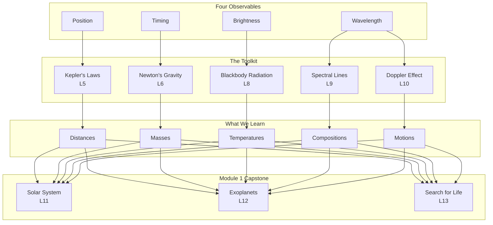

# Module Synthesis Design Specification

**Version:** 1.0
**Date:** 2026-02-01
**Author:** Dr. Anna Rosen + Claude
**Status:** Approved for Implementation

---

## 1. Executive Summary

This document specifies the design for **end-of-module synthesis materials** that transform the ASTR 101 course website into a comprehensive, textbook-like learning resource. Each module will include a `synthesis/` folder containing five documents that help students consolidate learning, see connections between concepts, and prepare for assessments.

### Design Principles

1. **Lecture-specific glossaries** — Each lecture shows only its own terms; full module glossary in synthesis
2. **Visual concept mapping** — Mermaid diagrams showing how ideas connect
3. **Narrative synthesis** — "Putting it together" documents that tell the module's story
4. **Tiered practice** — Problems organized by difficulty (★/★★/★★★)
5. **Transparent assessment** — Explicit "I can..." checklists for self-assessment

---

## 2. Folder Structure

### 2.1 Current Structure

```
modules/module-01/
├── readings/
│   ├── lecture-01-spoiler-alerts-reading.qmd
│   ├── lecture-02-foundations-reading.qmd
│   └── ...
└── slides/
    └── ...
```

### 2.2 New Structure (with synthesis)

```
modules/module-01/
├── readings/
│   └── (individual lectures - unchanged)
├── slides/
│   └── (individual slides - unchanged)
└── synthesis/
    ├── index.qmd                    # Synthesis landing page
    ├── glossary.qmd                 # Complete module glossary (tiered)
    ├── concept-map.qmd              # Visual connections (Mermaid diagrams)
    ├── putting-it-together.qmd      # Narrative synthesis
    ├── practice-problems.qmd        # Multi-concept problems
    └── exam-prep.qmd                # Self-assessment & sample questions
```

### 2.3 Navigation Integration

The synthesis folder should appear in the sidebar under each module:

```
Module 1: Foundations
  ├── Lecture 1: Spoiler Alerts
  ├── Lecture 2: Math Survival Kit
  ├── ...
  ├── Lecture 13: Are We Alone?
  └── Module 1 Synthesis              [expandable section]
      ├── Complete Glossary
      ├── Concept Map
      ├── Putting It Together
      ├── Practice Problems
      └── Exam Prep
```

---

## 3. Document Specifications

### 3.1 Synthesis Landing Page (`index.qmd`)

**Purpose:** Entry point for all synthesis materials with quick links.

**Content:**
- Brief description of what synthesis materials are available
- Card-based links to each synthesis document
- Module learning objectives summary
- "You've completed X lectures — here's what you can now do"

**Template:** See `assets/templates/synthesis-index-template.qmd`

---

### 3.2 Complete Glossary (`glossary.qmd`)

**Purpose:** Single reference for all terms introduced in the module.

**Features:**
- **Organized by lecture:** Terms grouped under L1, L2, etc. headers
- **Tiered display:** ★ Core terms (exam-essential) vs ◇ Supporting terms
- **Alphabetical index:** Optional A-Z quick-jump at top
- **Cross-references:** Links to where each term is first used

**Implementation:**
- Uses `` shortcode
- Shortcode renders both core and supporting tiers with visual distinction

**Visual Design:**
```
## Lecture 1: Spoiler Alerts

★ **Observable** — A quantity that can be directly measured...
★ **Inference** — Drawing conclusions about quantities we cannot directly access...
◇ **Lookback time** — The time light takes to travel from a distant object...

## Lecture 2: Math Survival Kit

★ **Scientific notation** — ...
◇ **SI prefix** — ...
```

---

### 3.3 Concept Map (`concept-map.qmd`)

**Purpose:** Visual representation of how ideas connect across lectures.

**Implementation:** Mermaid flowchart diagrams rendered by Quarto.

**Module 1 Concept Map Structure:**



**Additional Diagrams:**
- Observable → Model → Inference cycle
- Light lectures progression (L7 → L8 → L9 → L10)
- Historical development (Kepler → Newton)

---

### 3.4 Putting It Together (`putting-it-together.qmd`)

**Purpose:** Narrative synthesis that weaves everything together.

**Sections:**

1. **The Module Story** (2-3 paragraphs)
   - The intellectual journey from L1 to L13
   - Why this order? What's the logic?

2. **What You Can Now Do**
   - Concrete capabilities, framed as "Given X, you can determine Y"
   - Example: "Given a star's spectrum, you can determine its temperature, composition, and radial velocity"

3. **The Observable → Model → Inference Framework**
   - Explicit mapping of how each tool fits the framework
   - Table format showing observable, model, and inference for each

4. **Common Misconceptions Revisited**
   - Quick reference to "Spot the Assumption" insights from all lectures
   - Collapsible sections for each misconception

5. **Connections Forward**
   - How Module 1 prepares students for Module 2
   - What new questions arise?

---

### 3.5 Practice Problems (`practice-problems.qmd`)

**Purpose:** Multi-concept problems requiring synthesis of skills from multiple lectures.

**Organization:**

```markdown
## Warm-Up (★)
Single-concept review problems. If you struggle here, revisit the relevant lecture.

## Standard (★★)
Two-concept integration problems. These are exam-level.

## Challenge (★★★)
Multi-step problems requiring 3+ tools. These go beyond exam level.

## Capstone: Real Data Problems
Open-ended problems using actual astronomical data.
```

**Problem Format:**
```markdown
::: {.callout-note title="Problem 3 (★★)" collapse="false"}
**Concepts:** Doppler effect (L10), Wien's Law (L8)

A star's Hα line (rest wavelength 656.3 nm) is observed at 656.5 nm.
The star's peak emission is at 500 nm.

(a) Is the star moving toward or away from us? Calculate the radial velocity.
(b) What is the star's surface temperature?
:::

::: {.callout-tip title="Solution" collapse="true"}
**(a)** Redshift (λ_obs > λ_0) → receding...
**(b)** Wien's Law: T = b/λ_peak = ...
:::
```

**Problem Count Target:**
- Warm-Up: 5-8 problems
- Standard: 8-12 problems
- Challenge: 3-5 problems
- Capstone: 1-2 problems

---

### 3.6 Exam Prep (`exam-prep.qmd`)

**Purpose:** Explicit guidance on expectations and self-assessment.

**Sections:**

1. **Exam Format & Logistics**
   - Duration, allowed materials, question types
   - What to bring, what to expect

2. **Key Equations**
   - All equations students should be able to use
   - Brief "what it tells you" for each
   - NOT a formula sheet (conceptual understanding required)

3. **Self-Assessment Checklist**
   - "I can..." statements organized by lecture
   - Checkbox format for self-testing

   ```markdown
   ### Lecture 8: Blackbody Radiation
   - [ ] I can use Wien's Law to find temperature from peak wavelength
   - [ ] I can use Stefan-Boltzmann to compare luminosities
   - [ ] I can explain why hotter stars are blue and cooler stars are red
   - [ ] I can calculate how luminosity changes if temperature doubles
   ```

4. **Sample Questions**
   - 5-10 representative problems with full solutions
   - Annotated to show what's being tested

5. **Common Mistakes**
   - Top 5-10 errors students make
   - How to avoid each

---

## 4. Glossary System Updates

### 4.1 glossary.yml Schema Update

**Current Schema:**
```yaml
term_id:
  term: "Display Name"
  definition: "Definition text"
  context: "Additional context"
  first_use: "Lecture 3"      # String, not parsed
  module: 1
```

**New Schema:**
```yaml
term_id:
  term: "Display Name"
  definition: "Definition text"
  context: "Additional context"
  lecture: 3                  # Numeric, for filtering
  module: 1
  tier: core                  # "core" or "supporting"
```

### 4.2 Tier Definitions

| Tier | Meaning | Display |
|------|---------|---------|
| `core` | Exam-essential; students must define/use | ★ prefix |
| `supporting` | Helpful context; less likely tested directly | ◇ prefix |

### 4.3 Shortcode Updates

**New shortcode signatures:**

```markdown
           # Only L3 terms (for lecture readings)
            # All module 1 terms (for synthesis)
  # Only core terms from module 1
```

**Rendering behavior:**

1. **In lectures:** Show only that lecture's terms, both tiers, with ★/◇ prefix
2. **In synthesis glossary:** Show all module terms, grouped by lecture, with tier indicators

---

## 5. Implementation Phases

### Phase 1: Infrastructure (This Session)
- [x] Create spec document
- [ ] Create synthesis folder structure
- [ ] Create template files for all 5 documents
- [ ] Update glossary.yml with `lecture` and `tier` fields
- [ ] Update shortcodes.lua for new filtering

### Phase 2: Content (Future Sessions)
- [ ] Write Module 1 concept map (Mermaid diagrams)
- [ ] Write Module 1 "Putting It Together" narrative
- [ ] Create Module 1 practice problems
- [ ] Create Module 1 exam prep materials

### Phase 3: Polish
- [ ] CSS styling for tier indicators
- [ ] Navigation integration
- [ ] Cross-module consistency review

---

## 6. Open Questions

1. **Should synthesis materials be gated?** (e.g., "Complete L1-L10 readings to unlock")
2. **Should we add audio/video summaries?** (e.g., 5-minute video overview of module)
3. **Should the concept map be interactive?** (clickable nodes linking to lectures)

---

## 7. Success Metrics

- Students report using synthesis materials for exam prep
- Reduced "how does this connect?" questions in office hours
- Improved exam performance on multi-concept problems
- Positive feedback on concept maps in course evaluations

---

## Appendix A: File Naming Conventions

| File | Naming Pattern |
|------|----------------|
| Synthesis index | `modules/module-XX/synthesis/index.qmd` |
| Glossary | `modules/module-XX/synthesis/glossary.qmd` |
| Concept map | `modules/module-XX/synthesis/concept-map.qmd` |
| Synthesis narrative | `modules/module-XX/synthesis/putting-it-together.qmd` |
| Practice problems | `modules/module-XX/synthesis/practice-problems.qmd` |
| Exam prep | `modules/module-XX/synthesis/exam-prep.qmd` |

---

## Appendix B: Mermaid Diagram Guidelines

- Use `flowchart TB` (top-to-bottom) for hierarchical relationships
- Use `flowchart LR` (left-to-right) for temporal sequences
- Keep node text short (< 20 characters)
- Use subgraphs to group related concepts
- Include lecture references in node labels (e.g., "Kepler's Laws<br/>L5")
- Test rendering in Quarto preview before committing
