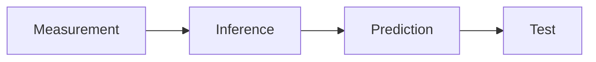

# Starter Lecture Deck (lecture-starter.qmd) — Full Feature Demo

This canvas contains **one file** you can drop into any Quarto project to demo (and then copy/paste) the core reveal.js + Quarto features and the highest-ROI extensions.

You’ll get:

- **Sections + vertical stacks** (optional “deep dive” slides)
- **Fragments** (progressive disclosure)
- **Auto-animate** (smooth equation/diagram morphs)
- **Speaker notes**
- **Columns + callouts + tabsets**
- **Code line highlighting**
- **Slide backgrounds**
- Extensions:
  - **pointer** (toggle with `q`)
  - **spotlight** (hold mouse / configurable)
  - **attribution** (edge-of-slide credits)
  - **quiz** (multiple choice)
  - **roughnotation** (animated annotations; press `R`)

---

## 1) Prereqs + install (do once per repo)

### 1.1 Quarto version

- **pointer** and **attribution** require **Quarto ≥ 1.2.124**.

### 1.2 Install extensions

Run these commands **in your project root** (where `_quarto.yml` lives).

```bash
# Reveal.js plugins (use `quarto add`)
quarto add quarto-ext/pointer
quarto add mcanouil/quarto-spotlight
quarto add quarto-ext/attribution
quarto add parmsam/quarto-quiz

# Filter-based extension (uses `quarto install extension`)
quarto install extension EmilHvitfeldt/quarto-roughnotation
```

**Important:** this creates an `_extensions/` folder. **Commit it** to your repo so builds are reproducible.

### 1.3 Run it

```bash
quarto preview lecture-starter.qmd
# or
quarto render lecture-starter.qmd
```

---

## 2) How to “drive” the interactive features live

- **Pointer:** press **`q`** to toggle pointer mode (color/size configurable).
- **Spotlight:** default is “hold mouse button to spotlight” (configurable).
- **RoughNotation:** press **`R`** to start annotation animations.
- **Quiz:**
  - `c` = check answers, `q` = reset (as configured below)
  - optional shuffle key `t`

---

## 3) The file: `lecture-starter.qmd`

Copy everything below into a file named `lecture-starter.qmd`.

```yaml
---
title: "ASTR 201 — Lecture Starter"
subtitle: "Quarto + reveal.js: the whole toolkit"
author: "Dr. Anna Rosen"

# Core reveal setup
format:
  revealjs:
    theme: default
    slide-number: true
    center: false
    transition: fade
    background-transition: fade

    # Shareable slide URLs
    hash: true

    # Built-in plugins (Quarto exposes these as format options)
    menu: true
    chalkboard: true

    # Nice defaults for teaching
    preview-links: true
    code-copy: true
    code-line-numbers: true

    # Vertical stacks: left/right moves between top-level slides;
    # up/down moves through the stack.
    navigation-mode: vertical
    controls-layout: bottom-right
    controls-tutorial: true

    # Quiz extension options live under revealjs:
    quiz:
      checkKey: 'c'
      resetKey: 'q'
      shuffleKey: 't'
      allowNumberKeys: true
      shuffleOptions: true
      includeScore: false

# Some extensions (pointer/spotlight) define their own top-level keys under format
# (this is extension-specific; see each extension README).
# Pointer defaults: key=q, color=red, pointerSize=16.
  pointer:
    key: q
    color: red
    pointerSize: 16
    alwaysVisible: false

  spotlight:
    size: 70
    toggleSpotlightOnMouseDown: true
    lockPointerInsideCanvas: false
    fadeInAndOut: 100

# Reveal.js plugin list (must include the plugin names)
revealjs-plugins:
  - pointer
  - spotlight
  - attribution
  - quiz

# Filter-based extension(s)
filters:
  - roughnotation

# If you include executable code, freeze keeps renders fast/stable.
execute:
  freeze: auto
---
```

## Warm-up: what this deck is doing

### Slide map (so you know what to steal)

- **Section slides** are `#` headings.
- **Stack slides** inside a section are `##` headings.

Within the deck you’ll see patterns for:

- Fragments
- Auto-animate
- Columns
- Callouts
- Tabsets
- Code line highlighting
- Background slides
- Attribution credits
- Quiz questions
- Spotlight/pointer instructions
- RoughNotation highlights

::: notes
Presenter workflow:

- Press `s` to open speaker view.
- Use `q` for pointer.
- Hold mouse for spotlight.
- Press `R` to animate roughnotation.
:::

## 1) Attention control (pointer + spotlight) + progressive disclosure

### Attention tools (use live)

- Press **`q`** to toggle the **pointer**.
- Hold the mouse button to enable the **spotlight**.

Now let’s reveal an idea in time:

::: {.incremental}

- Students can’t read ahead if the content doesn’t exist yet.
- Incremental reveal lets your narration stay in sync with their eyes.
- That’s the whole game.
:::

::: notes
Do a micro-demo: point at each bullet as it appears.
:::

### One-word fragment (inline)

Because Excel :::{.fragment} stinks :::

::: notes
This is the minimalist “fragment as punchline” pattern.
:::

## 2) Visual emphasis (RoughNotation)

### Animated emphasis (RoughNotation)

Press **`R`** to animate.

- The key assumption is [optically thin]{.rn}.
- The scaling is [power-law]{.rn} in radius.

::: notes
Use this to highlight the one term you want them to remember.
:::

## 3) Auto-Animate (smooth concept morphs)

### {auto-animate=true}

#### Start with the idea

\[ F \propto \frac{L}{4\pi d^2} \]

- You measure **flux** \(F\)
- You infer **luminosity** \(L\)

::: notes
Pause: ask them to predict what happens if d doubles.
:::

### {auto-animate=true}

#### Same slide, evolved

\[ F \propto \frac{L}{4\pi d^2} \]

- If \(d \to 2d\), then \(F \to F/4\)
- This is why distance errors hurt.

::: notes
This is the “same equation, new meaning” pattern.
:::

## 4) Layout patterns (columns + callouts + tabsets)

### Columns for comparisons

:::: {.columns}
::: {.column width="55%"}

#### Concept

- One sentence
- One diagram



:::

::: {.column width="45%"}

#### Common traps

::: {.callout-warning}

### Trap

Flux is not luminosity.
:::

::: {.callout-tip}

### Sanity check

Units + scaling + limits.
:::
:::
::::

::: notes
Mermaid is great for “process as a picture.”
:::

### Tabsets for “Concept / Math / Example”

::: {.panel-tabset}

#### Concept

Think in *scalings* before plugging numbers.

#### Math
\[ F \propto d^{-2} \]

#### Example
If the star is twice as far, it looks **4× dimmer**.
:::

## 5) Code blocks that teach (line highlighting)

### Line highlighting in code blocks

Use `code-line-numbers` on the code block to highlight lines.

```{.python code-line-numbers="1|3-4"}
# 1) Define the model
F = "L / (4π d^2)"

# 2) Scale distance
# If d doubles, F drops by 4
```

::: notes
Even with pseudo-code, highlighting works as a teaching pointer.
For real code, you can animate different highlighted sets with the `|` syntax.
:::

## 6) Attribution (clean credits for images/figures)

### A figure with clean attribution

(Replace this with your real image.)

::: {.attribution}
Image credit: your source here (e.g., observatory / dataset / CC license)
:::

::: notes
This is your “always credit imagery without cluttering the slide” move.
:::

## 7) Quick checks (Quiz extension)

### Which statement is true? {.quiz-question}

- Flux is intrinsic brightness.
- [Flux depends on distance.]{.correct}
- Luminosity depends on distance.
- Distance cancels out if you use magnitudes.

::: notes
Let them answer, then press `c` to check.
Then reset with `q` and ask: “What measurement do we actually have?”
:::

# 8) Slide backgrounds (full-bleed mood shifts)

## {background-color="black"}

**Dark background title slide**

- Use background slides sparingly.
- They’re great for “act breaks” and major conceptual pivots.

::: notes
Backgrounds are a spice, not a food group.
:::

## Slide Title {background-gradient="linear-gradient(to bottom, #283b95, #17b2c3)"}

**Gradient background** (good for section transitions)

::: notes
If your background is dark, explicitly set background-color to keep text readable.
:::

# 9) Content overflow (what to do when you wrote too much)

## Overflow tools (use sparingly)

- Prefer: **split the slide**.
- If you must:
  - `.smaller` (reduce font)
  - `.scrollable` (allow scroll)

::: {.callout-warning}
## Rule
If you need `.scrollable` twice in one lecture, your slide plan is lying to you.
:::

# 10) End slide (the “shareable summary”)

## The three things students should remember

1) **Measure** (photons)
2) **Model** (assumptions)
3) **Check** (units, scaling, limits)

::: notes
Final 30 seconds:
- “What assumption is most dangerous today?”
- “What would you measure next to break degeneracy?”
:::
```

---

## 4) Customization checklist (quick)

- Change `theme:` to your course theme or `theme: [default, theme.scss]`.
- Replace the attribution placeholder with your standard credit line.
- Decide whether you want `chalkboard: true` for every lecture or only derivation-heavy ones.
- If you don’t want vertical stacks by default, change `navigation-mode` back to `linear`.

---

## 5) Common gotchas

- If a plugin “does nothing,” 90% of the time it’s missing from `revealjs-plugins:`.
- If roughnotation highlights don’t animate, press `R`.
- If you use background images/videos, always sanity-check contrast.

---

If you want, I can generate a matching **`_metadata.yml` + `theme.scss`** “ASTR201 house style” that makes this deck instantly match your modern minimalist palette and typography.

